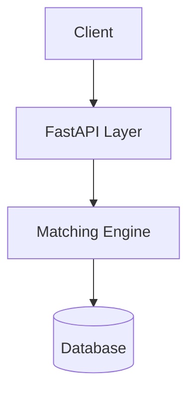

# Design & Architecture

## 1. Problem Analysis
The core challenge here is a variation of the **Dynamic Dial-a-Ride Problem (DARP)**. Since this is an NP-Hard problem, finding a mathematically "perfect" solution takes too long for a real-time app.

**My Goal**: create a solution that is "good enough" (efficient pooling) but extremely fast (<300ms).

## 2. High Level Architecture

I chose a classic layered architecture to keep things modular:



- **API Layer**: Handles the HTTP requests and validation.
- **Matching Engine**: This is where the magic happens. It queries the DB for active trips and decides if a new request fits.
- **Database**: Stores our state. I designed the schema to support ACID transactions to ensure data integrity.

## 3. Data Structures & Algorithms

### My Approach: Greedy Heuristic with Spatial Clustering
Instead of trying to re-shuffle everyone constantly, I used a **Greedy First-Fit** strategy.

1.  **Filter**: When a request comes in, I first query for *active* trips that have enough *seats* and *luggage space*.
2.  **Cluster**: I check if the trip's start point is reasonably close to the new user's pickup (within 5km).
3.  **Assign**: I assign the user to the first trip that fits these criteria.

**Complexity**:
-   **Time**: `O(N)` where N is number of active trips. With spatial indexing (like PostGIS), this would drop to `O(log N)`.
-   **Space**: `O(1)`.

## 4. Concurrency Strategy
This was the trickiest part. If the system has 10,000 users, multiple people might try to grab the last seat on a huge bus or cab at the same time.

**Solution: Optimistic Locking**
I didn't want to use heavy database locks (like `SELECT FOR UPDATE`) because they kill performance. Instead, I used an Atomic Update pattern.

When booking, I run a query like:
```sql
UPDATE trips 
SET current_seat_load = current_seat_load + 1 
WHERE id = :trip_id AND current_seat_load < max_capacity
```
If the database returns "0 rows updated", I know someone else stole the seat in the millisecond between me checking and booking. I then fail the request gracefully (or could retry).

## 5. Database Schema
I kept the schema normalized to avoid data duplication.

-   **Users**: Standard profile info.
-   **Vehicles**: Tracks capacity and current status (AVAILABLE/BUSY).
-   **Trips**: Represents an active journey. Links a Vehicle to a Route.
-   **RideRequests**: The individual booking from a user. links to a Trip when matched.

## 6. Dynamic Pricing
I implemented a simple formula for pricing:
`Price = (Base + Distance * Rate) * Discount`

If you are pooled (passenger count > 1), I give a 10% discount to incentivize sharing.
